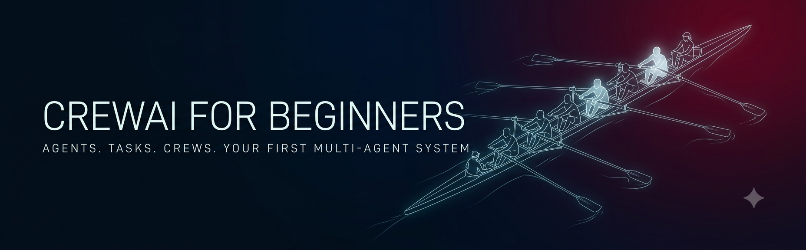
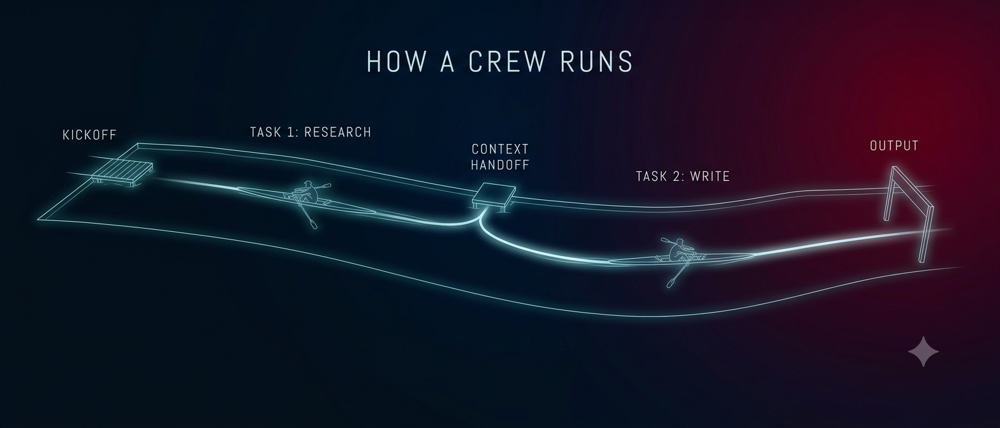
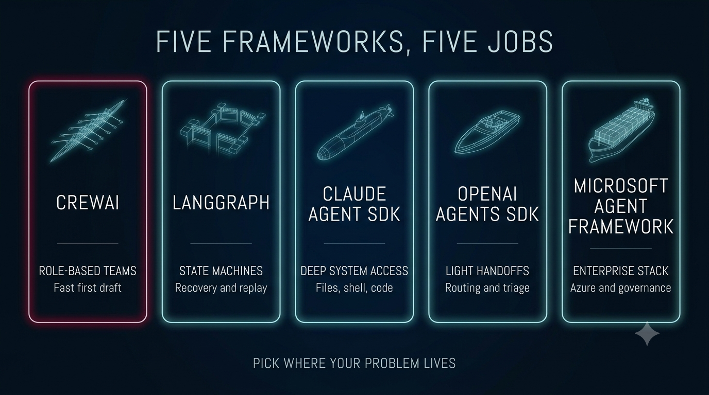

# CrewAI for Beginners

**Your first multi-agent system, without the part where you give up.**

Four examples that go from "two agents talking" to "a crew you could defend in a design review" — every one of them constructed and executed against **CrewAI 1.15.17**, the current release, not whatever version the tutorial you found last night was written for. That last part matters more than it sounds: CrewAI moves fast, and most of what Google returns for it no longer runs.

---

## The mental model


CrewAI has three ideas. Everything else is detail.

**An Agent is a system prompt with a job title.** You give it a `role`, a `goal`, and a `backstory`, and CrewAI compiles those into the instructions the model sees. That's it — there's no magic in the word "agent." The craft is that a model told *specifically* who it is and what it's optimizing for performs meaningfully better than one told "you are a helpful assistant."

**A Task is a work order.** A `description` of what to do and — the part beginners undervalue — an `expected_output` that says exactly what done looks like. Vague expected outputs are the number one cause of disappointing crews. "A report" gets you mush; "five bullet points, each with a source file named" gets you five bullet points with sources.

**A Crew is the roster plus the running order.** Which agents, which tasks, and a `process` — `sequential` (tasks run in order, each seeing the previous output) or `hierarchical` (a manager model decides who does what). Start sequential. [Example 03](examples/03-sequential-vs-hierarchical/) shows exactly what hierarchy costs before you're tempted by it.

A crew of agents is a relay team: each task hands its output to the next as context. That handoff is the whole trick — one model's draft becomes another model's input, with a different job title looking at it.



That picture is the entire execution model. `kickoff(inputs=...)` starts the run, each task is a leg of the river, and the context handoff in the middle is where task 1's full output physically arrives inside task 2's prompt. When your crew produces something strange, the answer is almost always somewhere on this river — a vague expected output on leg one, or a handoff carrying more context than leg two needed.

---

## The four examples

Work through them in order — each adds exactly one idea.

| | Adds | You'll understand |
| --- | --- | --- |
| [**01 — First Crew**](examples/01-first-crew/) | Nothing. Two agents, two tasks | What `role`/`goal`/`backstory` actually do to the prompt, why `expected_output` is the highest-leverage line you write |
| [**02 — Research Crew**](examples/02-research-crew/) | Tools | What a tool really is (a function signature the model can see), why the docstring IS the prompt, why a tool that can only read one folder is a permission boundary |
| [**03 — Sequential vs Hierarchical**](examples/03-sequential-vs-hierarchical/) | A manager | The same crew run both ways — what delegation looks like in the logs, and what it costs (we measured **3.0x the turns**) |
| [**04 — Governed Crew**](examples/04-governed-crew/) | Accountability | Budget caps, an audit log via `step_callback`, `human_input` approval, and what CrewAI gives you natively vs what you must build |

Every example runs with **one LLM key and nothing else** — no search-API signups, no vector databases. Example 02's tools read local files precisely so you can be running in the time it takes to export a key.

---

## Quickstart

```bash
git clone https://github.com/steviebuchicago/crewai-for-beginners.git
cd crewai-for-beginners/examples/01-first-crew

python -m venv .venv && source .venv/bin/activate   # Windows: .venv\Scripts\activate
pip install -r requirements.txt

export ANTHROPIC_API_KEY=sk-ant-...    # or OPENAI_API_KEY
python crew.py
```

You'll watch two agents work: a researcher gathers facts on the topic, a writer turns them into a brief. The `verbose=True` output shows you every prompt and handoff — read it once end to end and the framework stops being mysterious.

Model selection is one line on the agent:

```python
llm="anthropic/claude-sonnet-4-5"   # provider/model — needs crewai[anthropic]
```

---

## Seven things we hit that the tutorials don't mention

This repo's examples were verified by *running them* against 1.15.17, and these came out of that process — each one cost real debugging time and each is handled in the example code:

1. **`crewai[anthropic]` is an extra.** OpenAI support ships in the core package; Anthropic doesn't. If `llm="anthropic/..."` fails on a fresh install, this is why. Our `requirements.txt` files pin it.

2. **`max_iter` doesn't stop a runaway agent — it forces an answer.** An agent that hits its iteration cap returns something that *looks* like a real answer and isn't. If you cap iterations, you must also check whether the cap was hit. ([Example 04](examples/04-governed-crew/))

3. **`usage_metrics` is `None` on a run that stopped early.** Build a budget guard on it alone and an aborted run reports zero tokens — the exact moment you most want the number. Example 04's `Budget.reconcile()` falls back to live LLM counters.

4. **Two agents sharing one `LLM` object double-count usage.** Pass model *strings*, not shared instances, if you want per-crew numbers that add up.

5. **Hierarchical mode ignores your task-to-agent assignments.** The manager receives every task and delegates as it sees fit — and the delegate gets the manager's *paraphrase* of your task, not your carefully written `description`. ([Example 03](examples/03-sequential-vs-hierarchical/))

6. **Exceptions from inside a crew arrive wrapped.** `except YourError:` silently never matches, because CrewAI re-raises as `RuntimeError(...) from e`. Walk `__cause__` — example 04 ships a `find_cause()` helper.

7. **Telemetry is on by default.** `CREWAI_DISABLE_TELEMETRY=true` if that matters in your environment — in a regulated shop it does.

None of these are complaints. Every framework has sharp edges; the difference is whether the tutorial you're learning from has actually touched them.

---

## Where CrewAI sits in the landscape



Beginners usually meet CrewAI first and assume the frameworks are interchangeable. They aren't — they're different vessels built for different waters, and knowing which is which will save you from fighting your framework for a month. Here's the honest map as of mid-2026:

| Platform | Built around | Strongest at | Reach for it when |
| --- | --- | --- | --- |
| **CrewAI** | Roles and tasks — an organizational metaphor | Fastest path from idea to working multi-agent draft; the largest community (~52k stars, ~5M monthly downloads, ~2B agent executions in the prior year) | The work naturally maps to a team: researcher hands to analyst hands to writer |
| **LangGraph** | Explicit state machines with checkpointing | Durability — crash recovery, replay, time-travel debugging, approval pauses | "What happens when step 7 fails?" is a product requirement, not an afterthought |
| **Claude Agent SDK** (Anthropic) | A model with OS-level tools: files, shell, web | Deep system access and the deepest MCP tool integration; coding and operations agents | The agent's job is to *work on a computer* — read files, run commands, produce artifacts |
| **OpenAI Agents SDK** | Minimal primitives: agents, tools, handoffs, guardrails | The cleanest handoff model in the ecosystem; very light footprint | Triage and routing, where control passes linearly and you want almost no framework |
| **Microsoft Agent Framework** | The merger of AutoGen and Semantic Kernel (1.0 GA, April 2026) | Enterprise .NET/Python, Azure integration, group-chat deliberation with humans in the loop | You live in the Microsoft stack and need agents your platform team will bless |
| **Microsoft Copilot Studio** | Low-code agents inside Microsoft 365 | Getting an agent in front of business users without engineers, inside the tenant's governance | The audience is the M365 workforce and IT owns the guardrails |
| **Google ADK** | Multi-language SDKs (Python, TS, Java, Go) and the A2A protocol | Agent-to-agent interop across teams and languages | A large org where different teams' agents must discover and call each other |

Two smaller ones worth knowing: **Pydantic AI** if what you actually need is guaranteed-schema output from a single agent, and **smolagents** if you want a transparent ~1,000-line core running open-source models.

Three honest observations from using several of these:

**CrewAI's superpower and its trap are the same feature.** The role metaphor gets a beginner to a working system faster than anything else on this list — and it can seduce you into modeling a fixed pipeline as a "team" when a plain sequential script would be cheaper and more predictable. If your agents never make a real decision, you didn't need agents.

**The high-abstraction frameworks defer the governance bill; the low-level ones present it up front.** CrewAI's role definitions are not authorization. LangGraph makes you draw the state machine, which is annoying on day one and priceless in month three. None of them fully solve permissions, audit, or budget for you — that's [example 04](examples/04-governed-crew/), and the theme of [the companion repo](https://github.com/steviebuchicago/agents-are-easy-governance-is-hard).

**Provider-native SDKs trade portability for depth.** The Claude and OpenAI SDKs each do things with their own models that portable frameworks can't match, at the cost of coupling. CrewAI's neutrality — any model via a one-line string — is precisely why it's a good *first* framework: you learn the concepts without marrying a vendor.

Start where your problem lives, not where the loudest tutorial points.

---

## From laptop to deployed

When your crew works locally, the next question is how to put it somewhere. The short version: the `crewai` CLI scaffolds projects and deploys them to **CrewAI AMP** (app.crewai.com), where your crew becomes a REST API — `POST /kickoff` with your inputs, poll `/status/{kickoff_id}` for the result.


The full walkthrough — the scaffold wizard, both deploy paths, and the three governance questions to answer *before* anyone depends on your endpoint (including the `human_input=True` trap that hangs every first deployment) — is in **[docs/03 — Deploying Your Crew](docs/03-deploying-your-crew.md)**. Every terminal capture in it is real output from 1.15.17, not a mockup.

---

## When a crew is the right tool — honestly

Multi-agent is having its moment, which means it's being applied to problems that don't need it. The test:

**A crew earns its keep when the subtasks genuinely benefit from different instructions.** A researcher told "gather facts, cite files, flag what's contested" and a writer told "you write briefs for busy executives, lead with the answer" will beat one prompt trying to be both. Different jobs, different system prompts — that's the value.

**A crew is overhead when you're using it as a for-loop.** If your "agents" are the same instructions applied to different inputs, you want a loop over one model call. If your pipeline is fixed and deterministic, you want a pipeline — see [our companion repo](https://github.com/steviebuchicago/agents-are-easy-governance-is-hard) on when the fancy thing isn't the right thing.

And the theme of that companion applies here word for word: **agents are easy, governance is hard.** CrewAI makes the first afternoon delightful. What stands between that afternoon and something you'd let run at work is example 04.

---

## Repo layout

```
crewai-for-beginners/
├── docs/
│   ├── 01-core-concepts.md          the mental model, in depth
│   ├── 02-troubleshooting.md        the errors you'll actually hit
│   └── 03-deploying-your-crew.md    CLI, CrewAI AMP, and the /kickoff API
├── examples/
│   ├── 01-first-crew/               two agents, zero tools
│   ├── 02-research-crew/            custom @tool, local knowledge
│   ├── 03-sequential-vs-hierarchical/  same crew, both processes
│   └── 04-governed-crew/            budget, audit, human gate
└── LICENSE
```

---

## License

MIT — see [LICENSE](LICENSE). Use it, fork it, teach with it.

## About

Built by **Stephen A. Barry** — Chief Technology Officer in asset and wealth management, and Professor of AI in the University of Chicago's MS in Applied Data Science, where material like this gets tested on actual beginners every quarter.

Companion repos: [agents-are-easy-governance-is-hard](https://github.com/steviebuchicago/agents-are-easy-governance-is-hard) (the concepts) · [claude-agents-for-wealth-management](https://github.com/steviebuchicago/claude-agents-for-wealth-management) (the deep end).

[LinkedIn](https://www.linkedin.com/in/stevebarry25/) · [GitHub](https://github.com/steviebuchicago)
