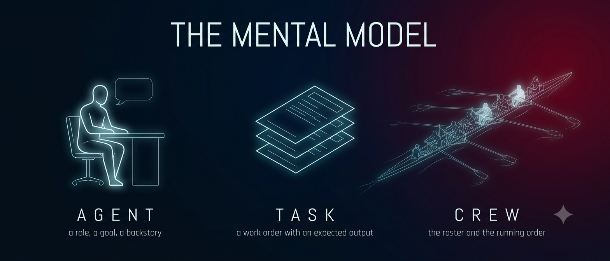

# Core Concepts

The README gives you the three ideas in three paragraphs. This file is the same three ideas with the lid off: what CrewAI actually does to your strings, verified by running the code rather than reading the docs.

Everything below was checked against **CrewAI 1.15.17** by introspecting the installed package and printing what the model receives. Where a number or a line of text appears, it came out of a real run.

---

## Agent

An Agent is a system prompt with a job title. That is not a simplification for beginners — it is the literal mechanism, and you can watch it happen.

CrewAI keeps a template file at `crewai/translations/en.json`. The relevant slice is four lines long:

```
role_playing:  "You are {role}. {backstory}\nYour personal goal is: {goal}"
```

`crewai/utilities/prompts.py` does the substitution with three `str.replace()` calls. That is the entire compilation step. Build this agent:

```python
Agent(
    role="Research Analyst",
    goal="Find the handful of facts about a topic that a smart outsider would actually need",
    backstory="You spent a decade as a desk analyst summarising unfamiliar industries.",
)
```

and the system message the model receives is exactly this:

```
You are Research Analyst. You spent a decade as a desk analyst summarising
unfamiliar industries.
Your personal goal is: Find the handful of facts about a topic that a smart
outsider would actually need
```

Three things follow, and they are the whole reason to know this.

**The field order is not the prompt order.** You write role, goal, backstory. The model reads role, backstory, goal. `backstory` is welded onto the end of the `role` sentence with a single space, which is why a backstory that starts mid-thought reads as gibberish in context and a backstory written as a second-person paragraph reads naturally.

**There is no other content.** No hidden scaffolding, no framework preamble, no "you are an AI agent" boilerplate. If the agent misbehaves, there is nothing to blame except those three strings — which is good news, because it means the fix is always within reach.

**Tools are appended to this same system message**, not passed as a separate schema, in the default text-ReAct path. An agent with no tools gets the four lines above and nothing else.

By default `use_system_prompt` is `True`, so the agent's identity goes in a `system` message and the work order goes in a `user` message. Two messages, one model call. That is all an agent turn is.

## Task

A Task is a work order, and it becomes the `user` message.

`Task.prompt()` glues the description to a fixed acceptance-criteria wrapper. For a task with `description="Research this topic: freight rates"` and `expected_output="A markdown list of 4-5 bullets."`, the user message comes out as:

```
Current Task: Research this topic: freight rates

This is the expected criteria for your final answer: A markdown list of 4-5 bullets.
you MUST return the actual complete content as the final answer, not a summary.

Provide your complete response:
```

### Why `expected_output` is the highest-leverage line you write

Look at where it lands. It is not a footnote and it is not documentation — it sits between the work and the instruction to answer, phrased as *criteria*. And because the executor accumulates messages rather than replacing them, that sentence is still in the list on the fifth turn of a tool loop, not just the first. The agent is grading its own draft against your words before it decides it is finished.

So the sentence you put there is a spec, and vagueness in a spec is delegated authorship. `expected_output="a good summary"` hands the definition of *done* to a process that is not stable at anything, and you get a different definition every run. `expected_output="A brief of 200-300 words, one-line summary first, then prose, no headings"` gets you that shape every run even though the words differ.

This is the single habit that separates a crew that demos well from one that behaves the same on Tuesday as it did on Monday.

### How task N's output reaches task N+1

Nothing in your code passes it. Here is what actually moves it.

`Crew._run_sequential_process` keeps a running list of `TaskOutput` objects. Before each task it calls `_get_context(task, task_outputs)`, which joins the raw text of those outputs with a divider and hands the string to the agent. The agent wraps it with one more slice:

```
{task}

This is the context you're working with:
{context}
```

Run three tasks with stubbed outputs and print the third task's user message, and you get this, verbatim:

```
Current Task: TASK-THREE-DESC

This is the expected criteria for your final answer: EO-THREE
you MUST return the actual complete content as the final answer, not a summary.

This is the context you're working with:
OUTPUT-OF-TASK-1

----------

OUTPUT-OF-TASK-2

Provide your complete response:
```

Note what that shows. The shorthand everywhere — this repo included — is "each task receives the previous task's output." With two tasks that is exactly right. With three or more it undersells it: **task three receives task one and task two, concatenated, separated by a ten-hyphen divider.** Prior outputs accumulate for the whole run.

That matters for two reasons. Cost, because by task six you are paying to re-send five earlier answers on every turn of task six. And attention, because a long early output can crowd out the task in front of the model.

The lever is `context=`, and it is not a boolean. Leave it unset and you get every prior output. Pass an explicit list of Tasks and you get exactly those. Pass `context=[]` and the task gets nothing at all — verified: the "This is the context you're working with" block disappears entirely.

```python
Task(..., context=[research_task])   # only this one
Task(..., context=[])                # deliberately isolated
```

An isolated task is a real tool. A fact-checker that cannot see the draft it is checking against is a different, better instrument than one that can.

## Crew

A Crew is the roster plus the running order, and it owns no intelligence of its own.

In `Process.sequential` — the default — the `tasks=[...]` list *is* the running order. Each task goes to the agent named in its `agent=` field. Three tasks means three model calls, decided before the program ran. You can predict the cost, and the run reproduces. The `agents=[...]` list is only a roster and its order means nothing. Omit `agent=` on a task and the `Crew(...)` constructor refuses to build, which is the good failure: you find out before spending anything.

In `Process.hierarchical`, CrewAI constructs a fourth agent you never declared. Its `role` is `Crew Manager`, its backstory ships in `en.json`, it runs on your `manager_llm`, and it holds two tools: *Delegate work to coworker* and *Ask question to coworker*. Every task is then handed to the manager rather than to the agent you assigned — `Crew._get_agent_to_use()` returns `self.manager_agent` whenever the process is hierarchical, and never looks at `task.agent`. Verified: a task with `agent=writer` runs on `Crew Manager`, and the writer's own LLM is never called at all until the manager chooses to delegate to it.

That is a real capability with a real price, and [example 03](../examples/03-sequential-vs-hierarchical/) measures both. Start sequential.

## Tools

A tool is a Python function the model is allowed to call. What reaches the model is not your function — it is the function's **name, its argument schema, and its docstring**, pasted into that same system message as plain text.

The schema is generated from your type annotations; the description is your docstring, verbatim, indentation and all. Which means your docstring is not documentation, it is prompt engineering, and it is the only instruction the model gets about when to call the thing and what to pass it. [Example 02](../examples/02-research-crew/) shows the rendered block, the failure modes a good docstring pre-empts, and the argument that matters most: **a tool is a permission boundary**, because an agent has exactly the reach of the functions you hand it and not one byte more.

## What CrewAI is not

**It is not magic.** There is no reasoning engine inside the Crew object. It is string assembly, a while-loop, and a parser. Everything intelligent that happens, happens in a model call you could have made yourself with `requests`. The framework's contribution is that you did not have to write the handoff, the ReAct loop, or the tool dispatch — worth having, and much smaller than the vocabulary suggests.

**It is not a job scheduler.** No queue, no retry policy you would trust, no dead-letter handling, no distributed anything. `kickoff()` is a blocking call in one process. If you need work to survive a restart, run at 3am, or fan out across machines, that is your scheduler's job and CrewAI is the thing it invokes.

**It is not a replacement for thinking about your pipeline.** The hardest question in this repo is not how to configure a Crew. It is whether the subtasks genuinely benefit from different instructions — because if they do not, you have written a for-loop with a middle manager. Multi-agent is a shape, not an upgrade. Pick it when the shape fits.

And the thing that makes a crew defensible is none of the above: it is the boundary, the record, the ceiling, and the human. That is [example 04](../examples/04-governed-crew/), and it is where the afternoon turns into engineering.

---

Next: [02 — Troubleshooting](02-troubleshooting.md), the errors you will actually hit.
