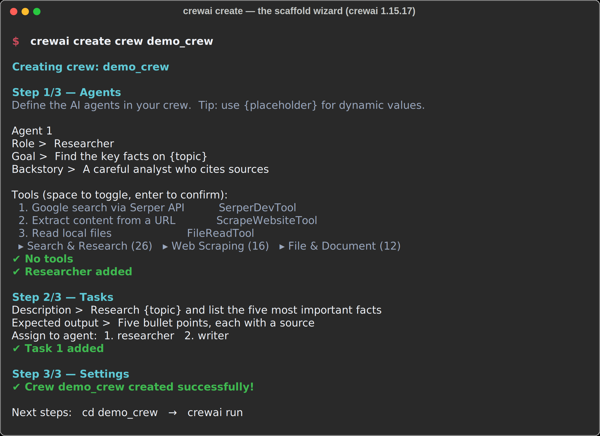
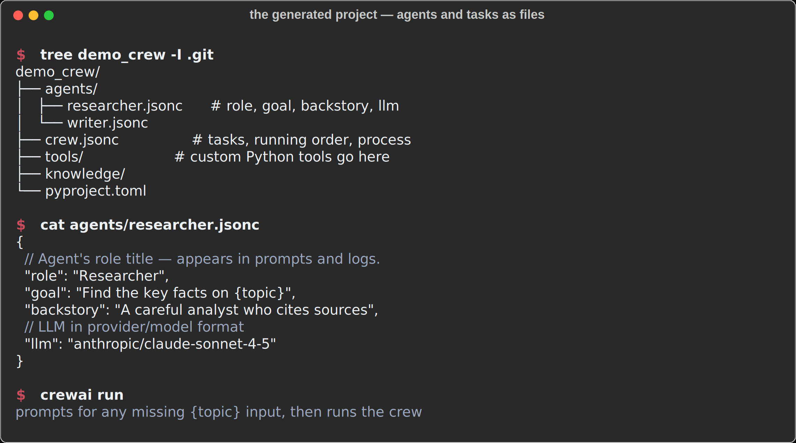
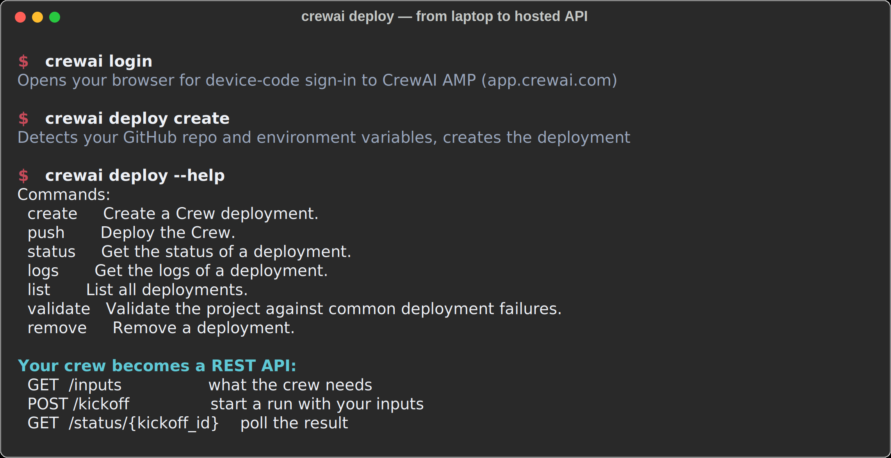

# 03 — Deploying Your Crew

**From a script on your laptop to an API someone else can call.**

Everything in the examples runs locally with `python crew.py`, and for learning that's exactly right. But the question arrives fast: *how do I put this somewhere?* This guide covers the three levels — running locally with the CLI, deploying to CrewAI's hosted platform, and what "deployed" should mean before you let anyone depend on it.

The terminal captures below are real output from **crewai 1.15.17**, generated while writing this guide — not mockups.

---

## Level 0 — the CLI scaffold

The examples in this repo define crews in plain Python so you can read every moving part. The CLI offers a second on-ramp: a wizard that scaffolds a project for you.



Three things worth noticing in that capture:

**The wizard asks for exactly what the mental model predicts.** Role, goal, backstory per agent; description and expected output per task; assignment of tasks to agents. If you've read [core concepts](01-core-concepts.md), nothing here is new — the wizard is just a form over the same three ideas.

**The tools catalog is large.** Seventy-plus tools across search, scraping, files, code, and cloud, most requiring their own API keys. The advice from [example 02](../examples/02-research-crew/) stands: fewer tools beat more tools, and a beginner crew with zero tools is a perfectly good crew.

**What it generates is files, not magic:**



Note the current scaffold generates **JSONC** config (`agents/*.jsonc`, `crew.jsonc`) — a newer layout than the `agents.yaml`/`tasks.yaml` you'll see in most tutorials, which is exactly the kind of drift this repo keeps warning you about. The Python API the examples use is unchanged; the scaffold format is just the CLI's packaging of the same fields. `crewai run` executes either.

---

## Level 1 — deploy to CrewAI AMP

CrewAI's hosted platform is **CrewAI AMP** at [app.crewai.com](https://app.crewai.com). The free tier is enough to learn the flow. Two paths in:

### The CLI path



In order:

```bash
crewai login            # device-code sign-in to app.crewai.com
crewai deploy create    # reads your GitHub repo + env vars, creates the deployment
crewai deploy status    # watch the build
crewai deploy logs      # when status isn't enough
crewai deploy push      # redeploy after changes
```

`crewai deploy validate` is the one nobody mentions: it checks your project against common deployment failures *before* you burn a build finding them. Run it first.

### The web path

In the AMP dashboard: **Connect GitHub → pick the repository → set environment variables → Deploy.** First build takes about a minute. Monorepo users: the subfolder option hides under Advanced settings.

Either way, your environment variables — `ANTHROPIC_API_KEY` or `OPENAI_API_KEY`, plus any tool keys — are set in the deployment, **never committed to the repo**. If a key has ever touched a public commit, rotate it; deleting the commit doesn't un-leak it.

### What you get

The deployed crew becomes a REST API with three endpoints that map exactly to what you already know:

| Endpoint | What it is |
| --- | --- |
| `GET /inputs` | The `{placeholder}` inputs your tasks declared |
| `POST /kickoff` | `crew.kickoff(inputs=...)`, over HTTP |
| `GET /status/{kickoff_id}` | Poll for the result — kickoffs are async |

Plus a dashboard with executions, traces, and timing — which is `verbose=True` grown up, and genuinely useful the first time a production run behaves differently than your laptop did.

---

## Level 2 — before anyone depends on it

Deploying is one afternoon. Being *deployable* is a different claim, and it's the theme this repo keeps returning to.

A deployed crew is an unattended API that spends money per request and returns model output to a caller who will act on it. Before that's wired into anything real, the questions from [example 04](../examples/04-governed-crew/) apply unchanged — and none of them are answered by the deploy button:

**What can it spend?** A public `/kickoff` endpoint with no rate limit is a budget incident waiting for a caller in a retry loop. Cap it at the caller, and reconcile spend from the platform's usage data — remembering the lesson from the [troubleshooting guide](02-troubleshooting.md) that `usage_metrics` reports nothing for runs that stopped early.

**What did it do?** The AMP trace view is good for debugging, but if the crew's output feeds a business decision, keep your own audit log at the caller: who kicked off, with what inputs, which prompt version, what came back. Example 04's JSONL pattern works unchanged over HTTP.

**Who checks the output?** `human_input=True` works locally because a human is at the terminal. Deployed, there is no terminal — a kickoff with `human_input` on a task will hang waiting for stdin that never comes. Deployed crews need the review step *outside* the crew: land the output somewhere a person approves before it goes anywhere that matters.

That last one is the classic first-deploy surprise, so it's worth saying twice: **remove `human_input=True` before deploying, and rebuild the approval as a step in front of whatever consumes the API.**

---

## Alternatives, honestly

You don't have to use AMP. A crew is Python; anything that runs Python runs it. Wrap `crew.kickoff()` in a FastAPI route and you have the same three endpoints on your own infrastructure — that's the right call when data can't leave your environment, and it's the shape of the self-hosted path in [the companion repo's deploy folder](https://github.com/steviebuchicago/claude-agents-for-wealth-management). The trade is exactly what you'd guess: AMP gives you builds, traces, and scaling for free; self-hosting gives you control and the audit boundary, and you carry the ops.

Start with AMP to learn what deployed feels like. Graduate to self-hosting when a real constraint — data residency, audit, cost — tells you to, not before.

---

**Previous:** [02 — Troubleshooting](02-troubleshooting.md) · **See also:** [Example 04 — Governed Crew](../examples/04-governed-crew/)
