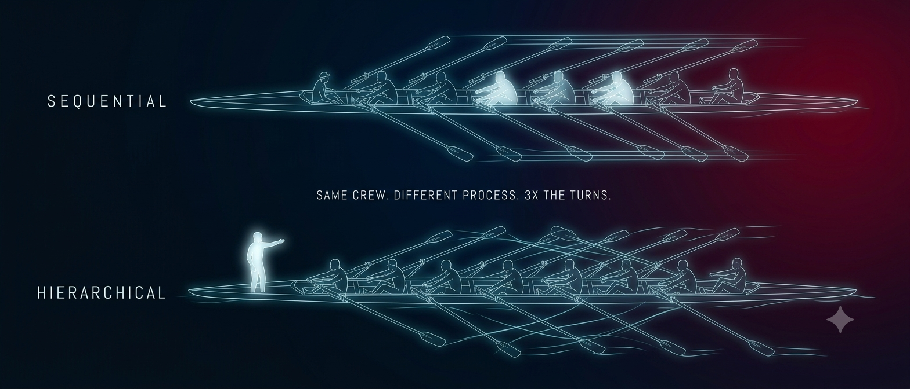

# 03 — Sequential vs Hierarchical



The same three agents and the same three tasks, run two ways. One line of configuration separates them, and it roughly triples your bill.

```bash
cd examples/03-sequential-vs-hierarchical
pip install -r requirements.txt

export OPENAI_API_KEY=sk-...          # or: export ANTHROPIC_API_KEY=sk-ant-...

python crew_sequential.py
python crew_hierarchical.py

diff crew_sequential.py crew_hierarchical.py
```

Both print `tokens`, `calls` and `elapsed` at the end. Run both and compare your own numbers before you believe any of the ones below.

---

## The setup

A Research Analyst, a Fact Checker and a Technical Writer. Research the topic, check the research, write the brief. The agent and task definitions are byte-identical across the two files — run the `diff` and you will see that everything outside the `Crew(...)` call is the same.

That is the point. This is a controlled comparison, not two different programs.

## What sequential does

Runs `tasks[]` top to bottom. Each task goes to the agent in its `agent=` field and receives the previous task's output as context.

Three tasks, three agents, **three model calls**. Nothing is decided at runtime. You can predict the cost before you run it and reproduce the run afterwards.

## What hierarchical actually does

This is the part the architecture diagrams leave out.

Setting `process=Process.hierarchical` makes CrewAI **build a fourth agent you never declared**. It is called `Crew Manager`, it runs on your `manager_llm`, and it is handed exactly two tools:

```
Delegate work to coworker
Ask question to coworker
```

Then every one of your tasks is given **to the manager**, not to the agent you assigned. The `agent=` field on each Task is *ignored* in this mode. It stays in your file, it still looks load-bearing, and it does nothing. What routes the work instead is the manager reading your `role` and `goal` strings and picking a name off the roster.

For each task the manager typically: takes the task, decides who should do it, calls the delegation tool, waits, reads what came back, and produces a final answer of its own. That is **three model calls where sequential made one.**

## The measured cost

Running both crews through a scripted stub, so the only variable is the framework's own behaviour:

| | Sequential | Hierarchical |
| --- | ---: | ---: |
| LLM turns | **3** | **9** |
| Turn order | fixed, matches `tasks[]` | decided at runtime |
| Agents involved | 3 | 4 (yours, plus the manager) |
| `task.agent` respected | yes | **no** |

Nine turns against three, for identical work and an identical result. That 3.0x is the *clean* case, where the manager delegates exactly once per task and accepts the first answer. It is a floor, not an average. A manager that asks a clarifying question first, or delegates twice because it did not like the first response, costs more — and nothing in the configuration bounds how much more.

Latency moves the same way, and worse than the token count suggests, because those calls are strictly sequential: the manager cannot decide who to delegate to until it has read the task, and cannot finish until the delegate has replied.

## The cost nobody mentions

Look at what the delegate actually receives. In the verbose log, the manager delegates and the coworker's task becomes:

```
Agent: Research Analyst
Task: do the work
```

Not your task description. **The manager paraphrases your task into its own words before handing it over.** Every sentence you carefully wrote in `description`, and every acceptance criterion you put in `expected_output`, is filtered through a summary written by another language model.

This is the real reason hierarchical output drifts. In example 01 the argument was that `expected_output` is what makes a stochastic process produce a stable shape. In hierarchical mode you have inserted a paraphrase between your specification and the agent doing the work.

## How to read the verbose output

Run `python crew_hierarchical.py` with `verbose=True` and one task looks like this:

```
Agent: Crew Manager
Task: Research this topic: container shipping rates
    ├── Tool: Delegate work to coworker
    │
    │   Agent: Research Analyst
    │   Task: do the work
    │   ✅ Agent Final Answer: [the researcher's actual output]
    │
    └── Tool: delegate_work_to_coworker  ← the result, returned to the manager
✅ Agent Final Answer: [the manager's version of it]
```

Four markers tell you what happened:

- **`Agent: Crew Manager`** with one of *your* task descriptions — the manager has opened a task. Sequential never prints this, because there is no manager.
- **`Tool: Delegate work to coworker`** — a delegation is being made. This is the moment the extra calls get spent.
- **A nested `Agent:` / `Task:` block** — the coworker running. Read the `Task:` line here and compare it with what you wrote. The gap between them is the paraphrase.
- **`Agent: Crew Manager` / `Final Answer`** — the manager closing the task with its own account of the result.

If you see `Crew Manager` open a task and go straight to `Final Answer` with no delegation between, the manager did the work itself. Your specialist agents were bypassed entirely, and you paid manager-model prices for it.

## When hierarchy earns its keep

Genuinely dynamic routing. All three conditions, not one of them:

1. **You do not know at authoring time which agent should handle a piece of work.** The right specialist depends on what is actually in the input — a support ticket that could be billing, technical or legal, and you cannot tell until you read it.
2. **The roster is large enough that a static `if` would be unmaintainable.** Three agents is not that. Fifteen might be.
3. **The work is genuinely open-ended**, so "how many steps is this" has no answer at authoring time.

That is a real shape. Triage, exploratory research where each finding changes the next question, incident response. In those cases the manager is doing something an ordered list cannot, and the extra calls buy you actual decisions.

## When it is cargo cult

Everything else, and particularly this repo's own example.

Research, then check, then write is a **fixed pipeline**. The order was known before the program ran, and it is the same order every time. Making a manager rediscover that order on every execution, at three times the cost, with your task descriptions paraphrased on the way through, buys nothing at all.

The trap is that hierarchical *sounds* more like a team. It has a manager and delegation and an org chart, and it maps neatly onto how humans organise. That resemblance is doing the persuading, not any observed benefit. A pipeline that pretends to be a team is still a pipeline — now with a middle manager who charges by the token.

Three smaller warnings, all verified against 1.15.17. Omitting `manager_llm` fails at `Crew(...)` construction with a pydantic `ValidationError`, not at kickoff — which is the good outcome, since you find out before spending anything. A `manager_agent` you supply yourself must have **no tools**; give it any and CrewAI raises `Manager agent should not have tools`. And because the manager is the agent reasoning about every task in the run, pointing `manager_llm` at the cheap model to save money usually costs more in bad routing than it saves per call.

## The recommendation

**Start sequential. Move to hierarchical when you can name the decision the manager is making that you could not have made yourself at authoring time.**

If you cannot name it in one sentence, you do not need a manager — you need a list. Most crews are a list.

## What is still missing

Neither file caps its spending, neither records what happened, and neither asks a human before the output is accepted. Hierarchical makes all three worse, because unbounded delegation is exactly the shape of failure that runs up a bill. That is [example 04](../04-governed-crew/).
